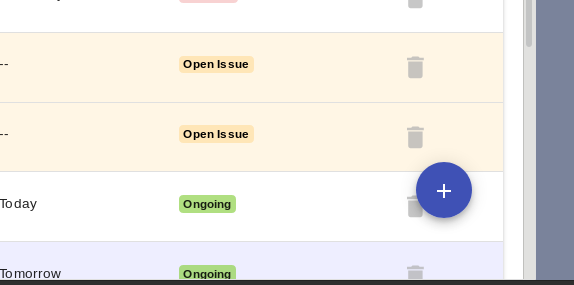
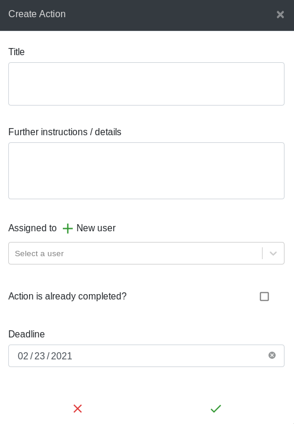

You can add content whenever you see the blue plus sign in the corner of your
screen. Hover over this sign and select which type of content you want to add

  

There are 3 types of content you can add to a dashboard:

#### 1. Actions

Actions are the most common content to add. They are given a deadline and are
assigned to a single user who has responsibility for updating / completing that
action.

  

The action form has 5 parts:

1. Action title - try to keep this short

2. Additional information  / details - extra information that will help the user
understand and complete the action

3. Assigned to - the user who is reponsible for updating / completing the action

4. Already completed? - check this box if you are recording an action that has
already been completed

5. Deadline - the date when the action needs to be completed by

#### 2. Milestones

Milestones are achievements rather than tasks. They have a deadline but are not
assigned to a user - instead the intervention lead / co-lead have responsibility
milestones in their intervention.

The add milestone form is the same as the add action form (above) except
that there is no option to assign the milestone to a user.

#### 3. Issues

Issues are raised by regular users who do not have permission
to add actions (see [dashboard roles](dashboard-roles)). An issue does not have
a deadline / assignee until an admin user converts it to an action
(see [changing content](changing-content))

The raise issue form is the same as the add action form (above) except
that there is no option to assign the issue to a user or give it a deadline