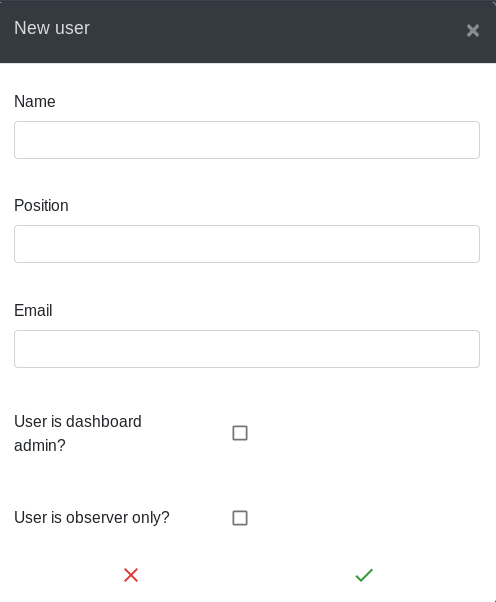

You can create a new user in two ways:
1. Click on your name in the top right corner, then click 'Add new user'
2. When [adding an action](add-action) you can create a new user to assign the action to

### Create user form

  

This form consists of 5 parts:

1. User name - the full name of the user

2. Position - the position the user holds within the context of the dashboard.
e.g. Finance team advisor

3. Email address - the email address of the new user

4. User is dashboard admin - check only if you want the new user to have
[full admin permission](dashboard-roles).

5. User is observer - for users who can view the whole dashboard but cannot make
any changes. See [dashboard roles](dashboard-roles).
