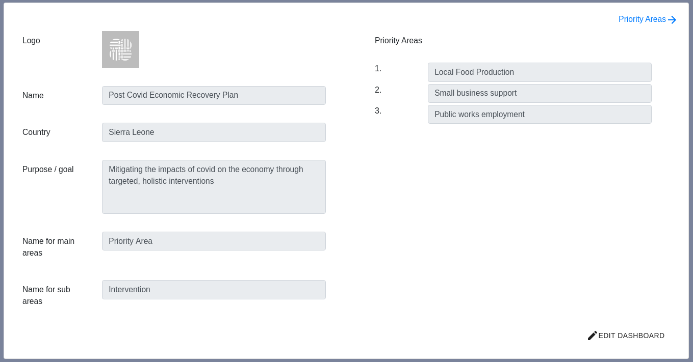
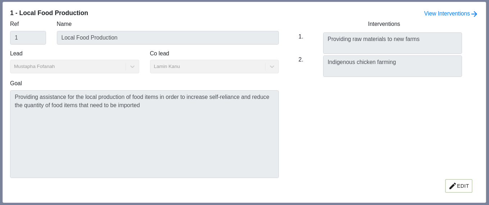
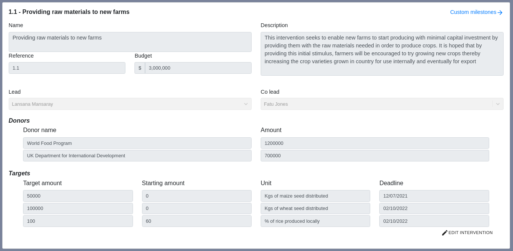
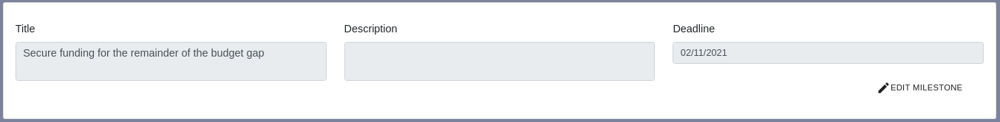
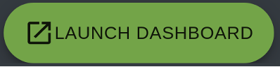

### Planning your dashboard configuration

When you first log in, you will see the planning form for your new dashboard.

  

  (Click image to open in new tab)

To make changes, click 'Edit Dashboard' in the bottom right corner

This form has 7 parts:

1. Dashboard logo - a small square or circular image that will be used on the
navigation bar and all emails sent out by your dashboard. If you leave it blank,
the TBI logo will be used

2. Dashboard name - This is the name used to refer to your specific dashboard

3. Country - The country where the dashboard is based

4. Purpose / goal - A short overview of what the dashboard is for. This
will appear in the navigation bar with the dashboard name and logo

5. Name for main areas - this is the name which is used for the main divisions within
your dashboard. TBI tend to use 'Priority Areas' or 'Projects'.

6. Name for sub areas - this is the name which is used for subdivision within
your main areas. TBI tend to use 'Interventions' or 'Initiatives'.

7. The name of the priority areas / projects that your dashboard is managing. You will have
the opportunity to add more details on the following page. New
priority areas / projects can also be added once the dashboard has been launched

Make sure to click 'Save changes' when you have finished.

### Planning your priority areas / projects

To view the priority areas / projects planning form, click the blue arrow link in the top right
corner of the previous form.

  

  (Click image to open in new tab)

This form has 6 parts:

1. Reference - usually a number to or letter. Used to refer to the priority area
/ project

2. Name - the name of the priority area project. Shorter names are better as
more detail can be added in the description / goals

3. Lead / Co Lead - these users will be able to view all content within the
priority area project, but will only be able to suggest updates. See
[dashboard roles](dashboard-roles)

4. Description / goals - a summary of what the priority area / project involves
and any goals it is trying to achieve

5. Interventions / initiatives - A list of all the interventions / intiatives /
sub projects involved within the main priority area / project. More detail can be added
on the following form

3. High level targets for the priority area
    - Target amount - the number that the target is trying to achieve
    - Starting amount - the number that you are currently at or started at
    - Unit - what your target is measured in
    - Deadline - when you hope to achieve the target by

(Please note you can also add lower level targets for each intervention on the next
planning pages)

<i>When a target is created, it will automatically create a milestone every
  3 months by diving the target amount into parts. The dashboard will remind you
  every time one of these milestones is due.

  This allows you to keep track of targets that may have a deadline that is far
  in the future
</i>

### Planning your interventions / initiatives

To view the interventions / initiatives planning form, click the blue arrow link in the top right
corner of the previous form.

  

  (Click image to open in new tab)

This form has 3 main parts:

1. Intervention / initiative information
    - Reference - this is usually the reference of the priority area project
   combined with the reference for the intervention / initiative seperated by a dot.
   (e.g 3.1 or 2.A)
    - Name - the name of the intervention. Shorter names are better as more
   details can be added in the description
    - Description - a general overview of the intervention and what it is trying to achieve

2. Donors or other stakeholders for the intervention / initiative
    - Donor name - the name of the donor / stakeholder
    - Amount - the amount of money being given (set to 0 for non-financial stakeholders)

3. Targets
    - Target amount - the number that the target is trying to achieve
    - Starting amount - the number that you are currently at or started at
    - Unit - what your target is measured in
    - Deadline - when you hope to achieve the target by

(Please note you can also add higher level targets for the priority area on the previous
planning pages)

<i>When a target is created, it will automatically create a milestone every
  3 months by diving the target amount into parts. The dashboard will remind you
  every time one of these milestones is due.

  This allows you to keep track of targets that may have a deadline that is far
  in the future
</i>

### Planning your custom milestones

:::tip

The dashboard uses the language of 'milestones' and 'actions.

A custom milestone is
usually considered to be a target that cannot be represented quantitively.
e.g. Delivery of key training event on 31 January

An action is a smaller piece of work that is assigned to one person. e.g. Submit
summary report based on this month's statistics.

This form is only for milestones, you can add specific actions once the dashboard
has been launched

:::

To view the custom milestones planning form, click the blue arrow link in the top right
corner of the previous form.

  

  (Click image to open in new tab)

This form has 3 parts:

1. Title - the title of the milestone

2. Description (optional) - any additional information about the milestone
that will enable the assignee to understand it better

3. Deadline - when the milestone is due to be completed

### Launching your dashboard

Once you have completed all of these forms, you can launch your dashboard
using the green launch dashboard button at the right-hand side of the navigation
bar.

  

To make changes, click the edit button in the bottom right corner

This form has 3 parts: