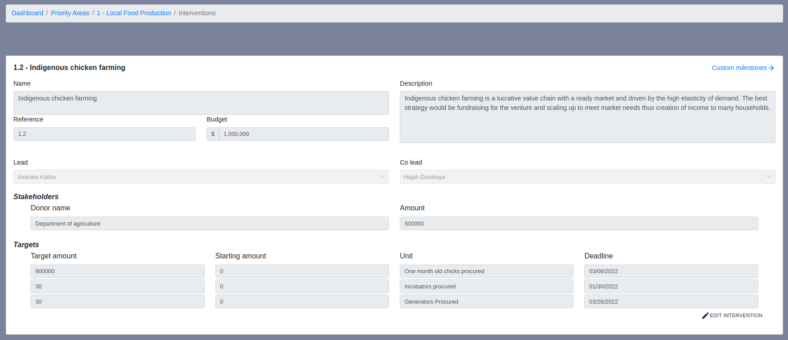
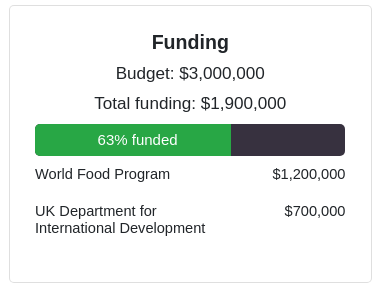
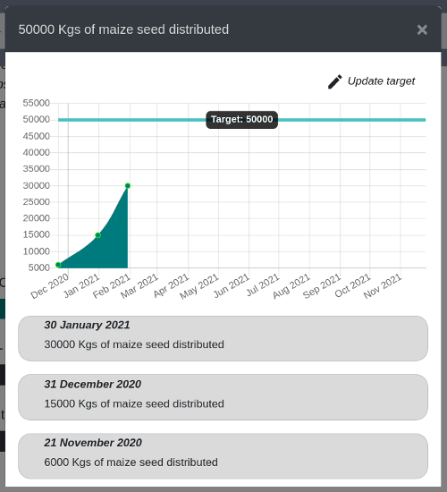
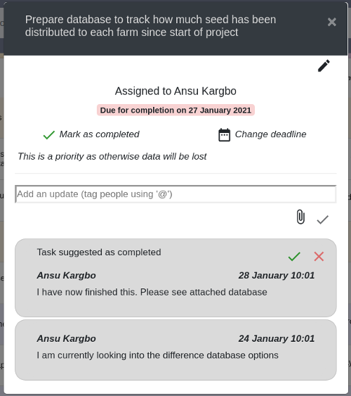
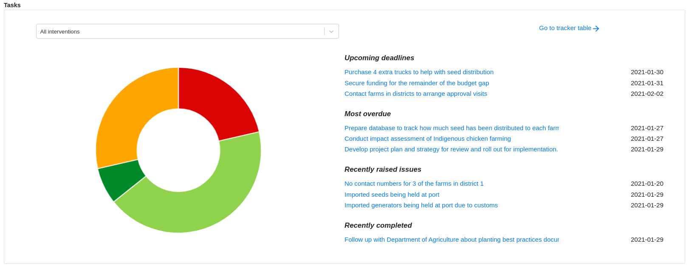
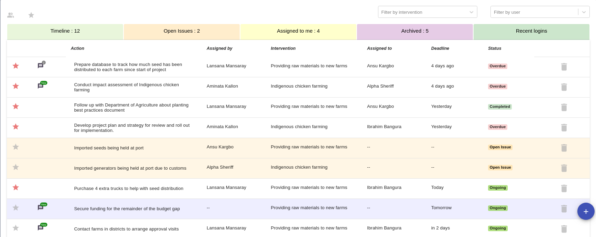

## Collaboratively plan projects

The dashboard platform provides an online template for planning projects where
all dashboard leads can contribute to the planning process.

There is no need to email around excel / word documents as everything is stored
on the platform itself. This means, multiple team members can plan at the same time,
streamlining the entire planning process.

  

  (Click to open image in new tab)

## Track budgets

The dashboard platform allows budgets to be tracked at all levels of the project. It also
maps different stakeholders to the areas in which they are involved, automatically calculating
the budget gap, and highlighting areas which are underfunded.

  

## Track quantitative data and targets

The dashboard allows targets / key performance indicators to be mapped against
different projects and initiatives. Quarterly milestones
are then automatically generated to help stay on top of these targets. All data is displayed
graphically in the project summary making it instantly visible what which targets are
on track and which are behind schedule.

  

## Create accountability within the project team

Each member of the dashboard has a clearly defined role (see [dashboard roles](dashboard-roles))
and every action for every project is assigned to a single team member and given a deadline.
The creates clear accountability within a project, and allows those working within that project to know
exactly what is expected of them, and when.

  

## Visualise how a project is progressing

The traffic light system is used throughout the site to provide a quick visual reference
as to whether a project is on track or falling behind schedule

  

  (Click to open image in new tab)

## See exactly what's coming up next, and what's overdue

The project table layout gives a clear timeline of what is completed, what is overdue and
what is coming up next. It is a useful tool to have open in meetings as actions can
be followed up, and new actions assigned - all of which becomes immediately available
to the relevant members of the team

  

  (Click to open image in new tab)

