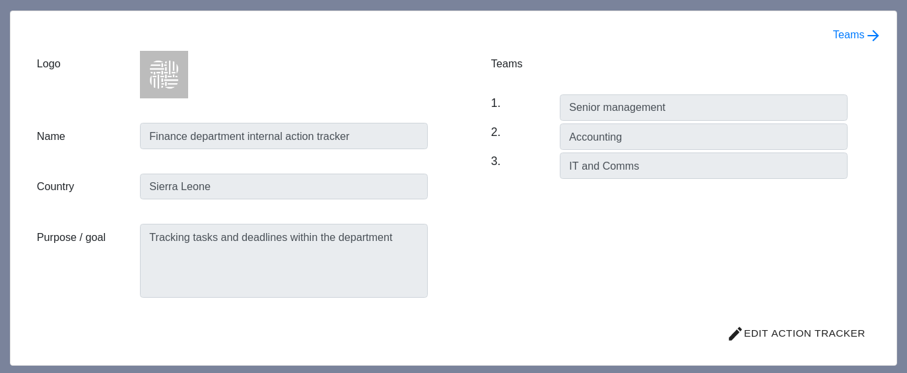
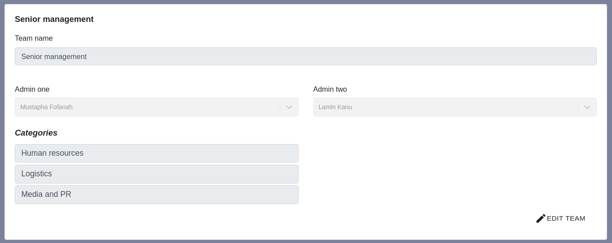
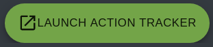

### Planning your action tracker configuration

When you first log in, you will see the planning form for your new action tracker

  

  (Click image to open in new tab)

To make changes, click 'Edit Action Tracker' in the bottom right corner

This form has 5 parts:

1. Action tracker logo - a small square or circular image that will be used on the
navigation bar and all emails sent out by your action tracker. If you leave it blank,
the TBI logo will be used

2. Dashboard name - This is the name used to refer to your specific action tracker

3. Country - The country where the action tracker is based

4. Purpose / goal - A short overview of what the action tracker is for. This
will appear in the navigation bar with the action tracker name and logo

5. The name of the teams that will be using this action tracker. You will have
the opportunity to add more details about the teams on the following page. New
teams can also be added once the action tracker has been launched

Make sure to click 'Save changes' when you have finished.

### Adding your team leads and categories

To view the Teams planning form, click the blue Teams arrow in the top right
corner of the previous form.

  

  (Click image to open in new tab)

To make changes, click 'Edit team' in the bottom right corner

This form has 3 parts:

1. Team name - the name that the action tracker will use to refer to that team.

2. Team leads - the users who will be able to see all of the actions within that team
(see [dashboard roles](dashboard-roles)). If left blank, the only person who
will be able to see actions for the whole team will be the dashboard admins

3. Categories - a useful way to subdivide your team into different areas. You
will need at least one category for each team. New categories can also be
created once the action tracker has been launched.

### Launching your action tracker

Once you have completed both of these forms, you can launch your action tracker
using the green launch action tracker button at the right hand side of the navigation
bar.

  

