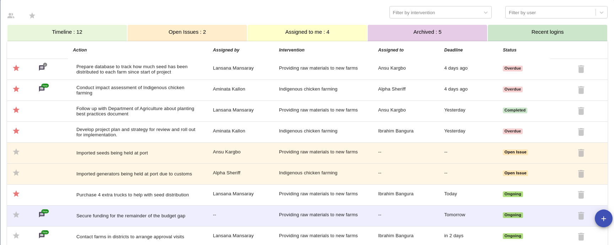
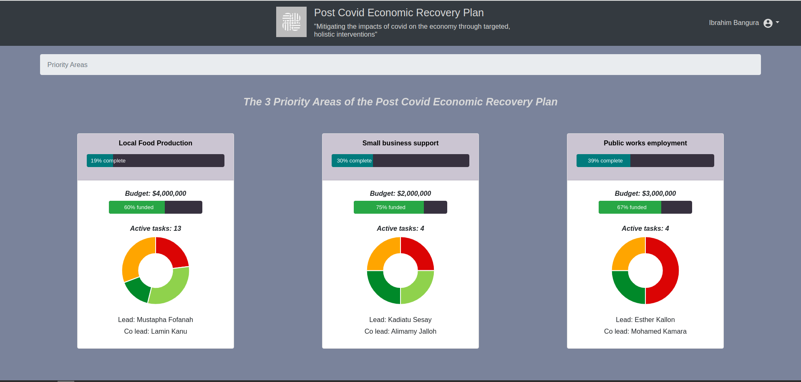

### Action Tracker Only

The action tracker only dashboard is focussed on tasks - who is responsible and when it is due.
It is used for non-project tracking where budgets / targets / key performance indicators are not
needed.

For example, a government department may have an internal action tracker to monitor tasks within
various teams in that department, but not specific to any projects.

  

  (Click image to open in new tab)

To see a full working example, please visit the [demo site](https://digital-dashboard-demo.herokuapp.com),
click on the user in the top right and 'Switch Dashboards' to the Finance Department Internal Action Tracker

### Full project dashboard

The full project dashboard is for tracking specific projects that may involve inter-departmental colloboration.
The full dashboard has access to all the tools including budget / target / milestone / key performance
indicator tracking. It has various roles to allow different users to access the parts of the dashboard that
they are involved with (see [dashboard roles](dashboard-roles))

  

  (Click image to open in new tab)

